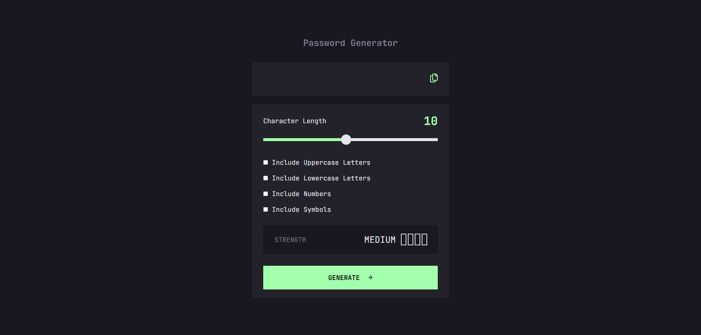

# Frontend Mentor - Password generator app solution

This is a solution to the [Password generator app challenge on Frontend Mentor](https://www.frontendmentor.io/challenges/password-generator-app-Mr8CLycqjh). Frontend Mentor challenges help you improve your coding skills by building realistic projects.

## Table of contents

- [Overview](#overview)
  - [The challenge](#the-challenge)
  - [Screenshot](#screenshot)
  - [Links](#links)
- [My process](#my-process)
  - [Built with](#built-with)
  - [What I learned](#what-i-learned)
  - [Useful resources](#useful-resources)
- [Author](#author)

## Overview

### The challenge

Users should be able to:

- Generate a password based on the selected inclusion options
- Copy the generated password to the computer's clipboard
- See a strength rating for their generated password
- View the optimal layout for the interface depending on their device's screen size
- See hover and focus states for all interactive elements on the page

### Screenshot

### Links

- [Solution URL](https://github.com/Antonvasilache/password-generator-app)
- [Live Site URL](https://password-generator-app-av.netlify.app/)

## My process

1. Building the page and adding the styles.
2. Adding responsiveness.
3. Creating the password generator algorithm.
4. Collecting the inputs from the form.
5. Adding the copy to clipboard functionality.
6. Creating the password strength check algorithm and formatting the styles accordingly.
7. Refactoring some of the functions.

### Built with

- Semantic HTML5 markup
- CSS custom properties
- Flexbox
- CSS Grid
- JavaScript

### What I learned

- Working with custom input elements
- Working with form data in vanilla JavaScript
- Creating random character generation using ASCII codes

### Useful resources

- [CSS Custom Range Slider](https://www.sitepoint.com/css-custom-range-slider/) - This article helped me to create my custom range slider and understand how to work around the browser defaults.

## Author

- Website - [Antonvasilache.com](https://www.antonvasilache.com)
- Frontend Mentor - [@Antonvasilache](https://www.frontendmentor.io/profile/Antonvasilache)
